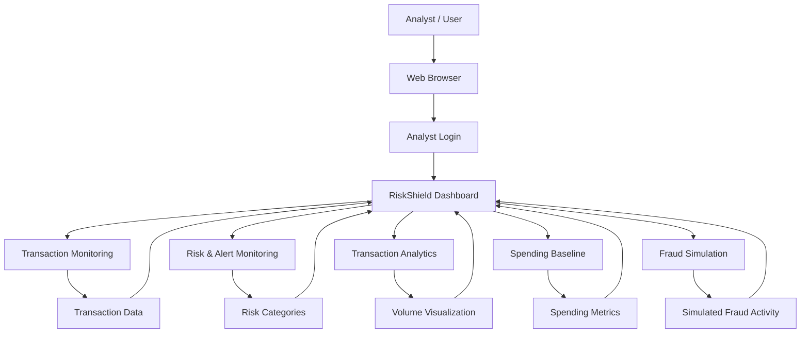
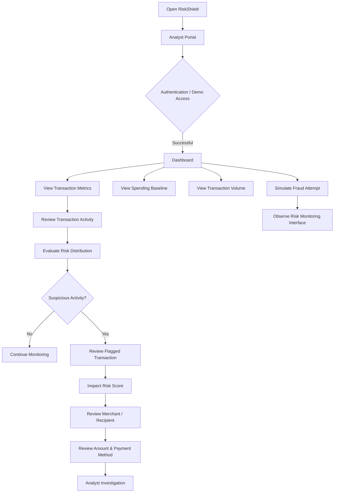
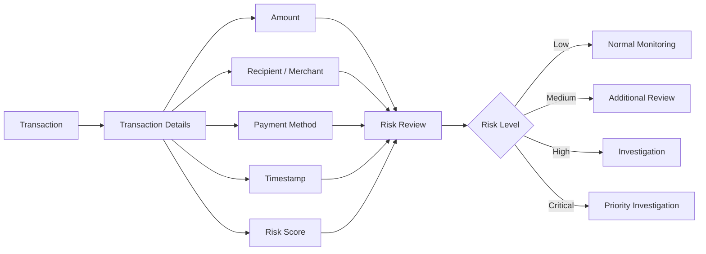
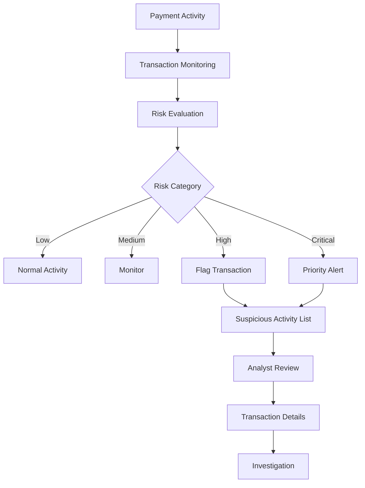
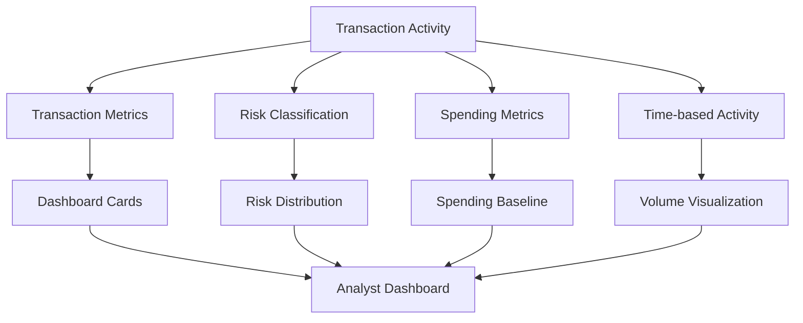
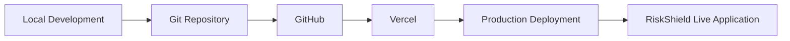
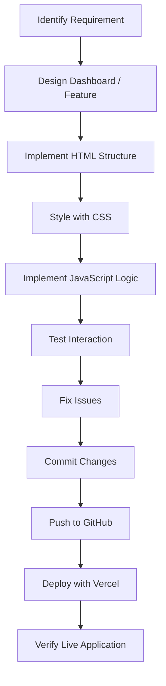

# 🛡️ RiskShield

### Payment Risk Detection & Monitoring Dashboard

RiskShield is a web-based payment risk monitoring dashboard designed to help analysts monitor transaction activity, identify suspicious transactions, review risk levels, and investigate flagged payment activity through a centralized interface.

The application provides an analyst-oriented dashboard with transaction metrics, risk distribution, spending baselines, suspicious activity alerts, transaction details, and fraud simulation capabilities.

---

## 🌐 Live Demo

🔗 **Live Application:**  
https://risk-shield-gules.vercel.app/

---

## 📌 Overview

Modern payment systems process a large number of transactions every day, making it difficult for analysts to manually identify unusual or potentially suspicious activity.

**RiskShield** provides a centralized monitoring interface where payment activity can be visualized and investigated through:

- Transaction monitoring
- Risk categorization
- Suspicious activity detection
- Transaction volume visualization
- Spending baseline analysis
- High-risk transaction identification
- Fraud simulation
- Alert monitoring
- Transaction-level investigation

The goal is to provide analysts with a clear and structured view of payment risk activity.

---

## 🎯 Problem Statement

Payment transaction data can become difficult to monitor when large amounts of activity occur across different payment methods and recipients.

Analysts need a dashboard that can help them quickly answer questions such as:

- How many transactions are being processed?
- How much transaction volume is being handled?
- How many transactions are suspicious?
- Which transactions have high or critical risk?
- What is the distribution of transaction risk?
- Which suspicious transactions require immediate attention?
- How does current spending compare with the baseline?
- Which payment activity should be investigated?

RiskShield addresses these monitoring and investigation requirements through a centralized dashboard.

---

# ✨ Key Features

## 🔐 Analyst Portal

RiskShield provides an analyst-oriented sign-in interface.

### Features

- Analyst login interface
- Work email and password fields
- Remember-session option
- Demo access
- Account creation interface
- Password reset/demo interaction

---

## 📊 Dashboard Overview

The main dashboard provides an overview of payment activity.

### Dashboard Metrics

- Total Transactions
- Processed Volume
- Safe vs Suspicious Transactions
- High Risk Amount
- Flagged Transaction Count
- Risk Rate

These metrics give analysts a quick overview of the current payment environment.

---

## 💳 Transaction Monitoring

The dashboard provides transaction-level monitoring information.

Transaction records can include:

- Transaction ID
- Transaction time
- Recipient / Merchant
- Transaction amount
- Payment method
- Risk score
- Risk category

This allows analysts to inspect individual transactions instead of relying only on aggregate statistics.

---

## 🚨 Suspicious Activity Monitoring

RiskShield highlights transactions requiring analyst attention.

Flagged activity can display:

- Transaction ID
- Timestamp
- Merchant / recipient
- Amount
- Payment method
- Risk score
- Risk severity

Risk categories include:

- 🟢 Low Risk
- 🟡 Medium Risk
- 🟠 High Risk
- 🔴 Critical

---

## 📈 Transaction Volume Analytics

The dashboard includes a transaction-volume visualization for monitoring payment activity over time.

Analysts can view transaction activity across different periods such as:

- 24 Hours
- 7 Days
- 30 Days

---

## 🛡️ Risk Distribution

RiskShield provides a visual breakdown of transactions according to risk level.

### Risk Categories

```text
                    ┌─────────────────────┐
                    │   TRANSACTIONS      │
                    └──────────┬──────────┘
                               │
              ┌────────────────┼────────────────┐
              │                │                │
              ▼                ▼                ▼
        ┌──────────┐     ┌──────────┐     ┌──────────┐
        │ Low Risk │     │ Medium   │     │ High Risk│
        │          │     │ Risk     │     │          │
        └──────────┘     └──────────┘     └────┬─────┘
                                               │
                                               ▼
                                        ┌────────────┐
                                        │  Critical  │
                                        └────────────┘
```

---

## 💰 Spending Baseline Summary

RiskShield provides spending-related summary information including:

- Daily Spend
- Weekly Spend
- Monthly Average
- Average Transaction

This provides additional context when reviewing potentially suspicious payment activity.

---

## ⚠️ Fraud Simulation

The dashboard includes a **Fraud Attempt / Simulate Fraud** interaction.

This allows the application to demonstrate how suspicious activity can appear within the monitoring interface.

> Note: The fraud simulation is a demonstration feature of the application and should not be interpreted as a production financial fraud-detection engine.

---

# 🏗️ System Architecture

RiskShield is implemented as a web application with a client-side interface consisting of HTML, CSS, and JavaScript.



---

# 🔄 Application Workflow



---

# 🔍 Transaction Investigation Workflow



---

# 🚨 Suspicious Activity Workflow



---

# 📊 Dashboard Data Flow



---

# 🧩 Main Dashboard Components

```text
┌─────────────────────────────────────────────────────────────┐
│                     RISkSHIELD                              │
│  Search | Simulate Fraud | Alerts | Account                │
├─────────────────────────────────────────────────────────────┤
│                                                             │
│                    DASHBOARD OVERVIEW                       │
│                                                             │
│  ┌───────────────┐  ┌──────────────────┐                  │
│  │ Transactions  │  │ Processed Volume │                  │
│  └───────────────┘  └──────────────────┘                  │
│                                                             │
│  ┌───────────────┐  ┌──────────────────┐                  │
│  │ Safe vs       │  │ High Risk Amount │                  │
│  │ Suspicious    │  │                  │                  │
│  └───────────────┘  └──────────────────┘                  │
│                                                             │
│  ┌───────────────────────────────────────────────────────┐ │
│  │             Transaction Volume Over Time              │ │
│  └───────────────────────────────────────────────────────┘ │
│                                                             │
│  ┌───────────────────────────────────────────────────────┐ │
│  │                  Risk Distribution                    │ │
│  └───────────────────────────────────────────────────────┘ │
│                                                             │
│  ┌───────────────────────────────────────────────────────┐ │
│  │               Spending Baseline Summary               │ │
│  └───────────────────────────────────────────────────────┘ │
│                                                             │
│  ┌───────────────────────────────────────────────────────┐ │
│  │       Flagged Suspicious Activity                     │ │
│  └───────────────────────────────────────────────────────┘ │
│                                                             │
└─────────────────────────────────────────────────────────────┘
```

---

# 🗂️ Project Structure

```text
RiskShield/
│
├── css/
│   └── [Stylesheets]
│
├── js/
│   └── [JavaScript files]
│
├── index.html
│
└── README.md
```

### Directory Responsibilities

| Directory / File | Purpose |
|---|---|
| `index.html` | Main application entry point |
| `css/` | Application styling |
| `js/` | Client-side application logic |
| `README.md` | Project documentation |

---

# 🛠️ Technology Stack

### Frontend

- HTML5
- CSS3
- JavaScript

### Development & Deployment

- Git
- GitHub
- Vercel

### Application Concepts

- Payment transaction monitoring
- Risk categorization
- Dashboard analytics
- Data visualization
- Suspicious activity monitoring
- Fraud simulation

---

# 🎨 User Interface

RiskShield uses a dark analyst-dashboard interface designed around financial monitoring.

### Interface Areas

- Analyst Sign In
- Navigation / Search
- Dashboard Overview
- Transaction Metrics
- Transaction Volume Chart
- Risk Distribution
- Spending Baseline
- Suspicious Activity
- Alerts
- Fraud Simulation

---

# 🔐 Analyst Portal

```text
┌──────────────────────────────────────┐
│       Analyst Portal Sign In         │
│                                      │
│  Work Email                          │
│  ┌────────────────────────────────┐  │
│  │ analyst@example.com            │  │
│  └────────────────────────────────┘  │
│                                      │
│  Password                            │
│  ┌────────────────────────────────┐  │
│  │ •••••••••                      │  │
│  └────────────────────────────────┘  │
│                                      │
│       [ Sign In to RiskShield ]      │
│                                      │
│       Quick Demo Access              │
└──────────────────────────────────────┘
```

---

# 📈 Analytics Overview

```text
                    ANALYST DASHBOARD
                           │
        ┌──────────────────┼──────────────────┐
        │                  │                  │
        ▼                  ▼                  ▼
 Transaction          Risk Analysis      Spending
 Monitoring                              Analysis
        │                  │                  │
        ▼                  ▼                  ▼
   Transaction       Risk Distribution    Daily Spend
     Volume          Low / Medium /       Weekly Spend
   Processed          High / Critical     Monthly Average
     Amount                               Avg Transaction
        │                  │                  │
        └──────────────────┼──────────────────┘
                           ▼
                  Suspicious Activity
                           │
                           ▼
                    Analyst Review
```

---

# 🚨 Risk Classification

The dashboard represents transaction risk using four levels:

| Level | Purpose |
|---|---|
| 🟢 Low | Lower-risk transaction activity |
| 🟡 Medium | Activity requiring monitoring |
| 🟠 High | Activity requiring further review |
| 🔴 Critical | Highest-priority flagged activity |

Risk scores are displayed alongside flagged transactions to provide additional context during investigation.

---

# 🧪 Demonstration & Simulation

```text
Normal Activity
      │
      ▼
Fraud Simulation
      │
      ▼
Suspicious Activity
      │
      ▼
Risk Classification
      │
      ▼
Dashboard Update
      │
      ▼
Analyst Review
```

The simulation is intended for demonstration of payment-risk monitoring concepts.

---

# 📱 Responsive Dashboard

The interface is designed as a dashboard experience with:

- Structured cards
- Charts
- Transaction tables
- Alert sections
- Navigation controls
- Risk indicators
- Responsive web layout

---

# 🚀 Deployment

RiskShield is deployed using **Vercel**.

### Deployment Flow



### Live Application

🔗 https://risk-shield-gules.vercel.app/

---

# 💻 Running Locally

## 1. Clone the repository

```bash
git clone https://github.com/Sreehitha24/RiskShield.git
```

## 2. Navigate into the project

```bash
cd RiskShield
```

## 3. Open the application

The project uses a lightweight HTML/CSS/JavaScript structure.

You can run it using a local development server such as VS Code Live Server.

```text
Open index.html
        ↓
Start Live Server
        ↓
Open application in browser
```

---

# 🧭 Development Workflow



---

# 🧪 Testing Checklist

- [ ] Login interface
- [ ] Demo access
- [ ] Dashboard loading
- [ ] Navigation
- [ ] Transaction metrics
- [ ] Transaction chart
- [ ] Risk distribution
- [ ] Spending baseline
- [ ] Suspicious activity section
- [ ] Fraud simulation
- [ ] Alert interactions
- [ ] Responsive layout
- [ ] Live deployment

---

# 📚 Learning Outcomes

Through this project, the development process involves practical exposure to:

- Frontend web development
- Dashboard UI design
- JavaScript-based interactions
- Data visualization concepts
- Transaction monitoring concepts
- Risk categorization
- Alert-oriented UI design
- Responsive interface development
- Git and GitHub
- Web deployment with Vercel

---

# 🔮 Future Enhancements

Potential future improvements include:

### Backend Integration

```text
Frontend
    │
    ▼
Backend API
    │
    ├── Authentication
    ├── Transaction Service
    ├── Risk Service
    └── Alert Service
            │
            ▼
        Database
```

### Additional Enhancements

- Real backend API integration
- Persistent transaction storage
- Role-based access control
- Real-time transaction ingestion
- Advanced filtering and search
- Transaction detail pages
- Alert management
- Investigation workflow
- Audit logs
- Production-grade authentication
- Machine-learning-based risk scoring
- External payment-service integration

> These are future enhancements, not claims about the current implementation.

---

# 🏆 Project Highlights

### 🔹 Analyst-Centric Interface
Designed around the workflow of reviewing payment activity and suspicious transactions.

### 🔹 Risk Visibility
Provides clear visual categorization of transaction risk.

### 🔹 Transaction Analytics
Combines transaction volume, processed amount, risk distribution, and spending information.

### 🔹 Suspicious Activity Monitoring
Provides a dedicated interface for reviewing flagged activity.

### 🔹 Interactive Demonstration
Includes fraud-simulation functionality for demonstrating risk-monitoring scenarios.

### 🔹 Cloud Deployment
The application is deployed and accessible through Vercel.

---

# 📸 Screenshots

## Analyst Login

Add the RiskShield login screenshot here.

```text
docs/screenshots/login.png
```

## Dashboard

Add the dashboard overview screenshot here.

```text
docs/screenshots/dashboard.png
```

## Risk Distribution

Add a screenshot showing risk distribution and transaction analytics.

```text
docs/screenshots/risk-distribution.png
```

## Suspicious Activity

Add a screenshot showing flagged suspicious transactions.

```text
docs/screenshots/suspicious-activity.png
```

---

# 🔗 Project Links

| Resource | Link |
|---|---|
| 🌐 Live Demo | https://risk-shield-gules.vercel.app/ |
| 💻 GitHub | https://github.com/Sreehitha24/RiskShield |
| 👩‍💻 GitHub Profile | https://github.com/Sreehitha24 |
| 🔗 LinkedIn | https://www.linkedin.com/in/keerthipati-sreehitha/ |

---

# 👩‍💻 Author

## Keerthipati Sreehitha

Computer Science & Data Science Student  
KKR & KSR Institute of Technology and Sciences

### Interests

- Software Development
- Web Development
- Artificial Intelligence
- Cloud Computing
- Problem Solving

---

## 🌐 Connect

[](https://github.com/Sreehitha24)

[](https://www.linkedin.com/in/keerthipati-sreehitha/)

---

# ⭐ Project Summary

**RiskShield** is a web-based payment risk monitoring dashboard that brings transaction metrics, risk distribution, spending analysis, suspicious activity monitoring, alerts, and fraud simulation into a centralized analyst interface.

The project demonstrates practical frontend development, dashboard design, transaction-monitoring concepts, interactive visualization, and web deployment.

---

⭐ If you find this project useful, feel free to explore the repository and live demo.
